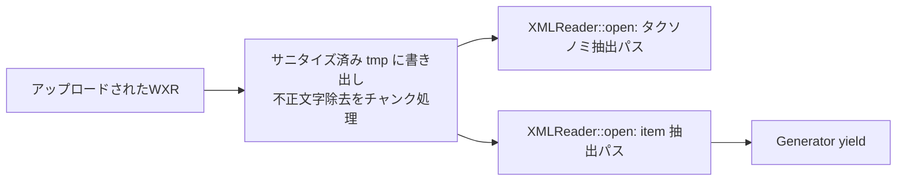
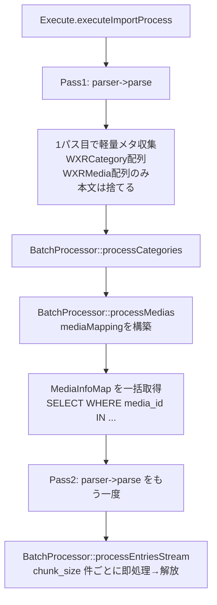

# 設計: WXRImport プラグインのパフォーマンス改善

## 全体方針

- **既存パブリックインタフェースを温存する**。`Parser::parse(): \Generator`, `BatchProcessor::processAll()`, `Downloader::downloadMedia()` のシグネチャは変更しない。内部の I/O とアルゴリズムだけ差し替える。
- **「全件展開」を「2パス・ストリーミング」に置き換える**。WXR を 2 回ストリームで読み、1パス目で軽量メタ情報（カテゴリ／メディア）を確定し、2パス目で本文ありのエントリーをバッチで流す。
- **DB 往復の削減はバッチ単位の前処理で実現する**。バッチに入る前に必要な集約値（`MAX(sort)` や `media` メタ）を1回だけ取り、メモリ上で払い出す。
- **セキュリティ要件（旧 `20260511-security-hardening`）の挙動は維持する**。SSRF防御の自前リダイレクト追跡・MIME検証・パストラバーサル検証はそのまま動くようにストリーミング化する。
- **各改善は独立してコミット可能な粒度に分割する**（レビュー容易性のため）。

---

## 変更対象ファイル

| ファイル | 主な変更 |
|----------|----------|
| `src/Services/WXR/Parser.php` | `XMLReader::open()` 化 / 不正文字除去のストリーム化 / item内 XPath を相対化 / dedup の O(1) 化 |
| `src/POST/WxrImport/Execute.php` | 全件 buffering を廃止し、2パス・ストリーミングへ。`sleep(5)` 撤去。フェーズ計測ログ追加 |
| `src/Services/Import/BatchProcessor.php` | `memoryLimit` 算出修正 / 受け取りを Generator 化 / バッチ前処理（sort値・media情報の事前取得） / 不要 `usleep` の設定可能化 |
| `src/Services/Media/Downloader.php` | cURL 取得をストリーム保存化 / ローカルコピーを `stream_copy_to_stream` 化 / DNS キャッシュ追加 |
| `src/Services/Content/ContentProcessor.php` | DB ルックアップ廃止、注入された `MediaInfoMap` を参照 |
| `src/Services/Import/EntryImporter.php` | sort 値の払い出しヘルパー注入 / サブカテゴリ・タグの multi-row insert / 重複呼び出し削除 |
| `src/Services/Import/CategoryCreator.php` | トポロジカルソート化 / Nested Set 一括計算＋一括 UPDATE |

新規ファイル（小さなヘルパー）:

| ファイル | 役割 |
|----------|------|
| `src/Services/Import/MediaInfoMap.php` | media_id → `{path, type, filesize}` の一括取得結果を保持し、ContentProcessor に注入する VO |
| `src/Services/Import/SortValueAllocator.php` | バッチ先頭で `entry_sort` / `entry_user_sort` / `entry_category_sort` の MAX を取り、in-memory で払い出す |
| `src/Services/Helpers/MemoryLimit.php` | `ini_get('memory_limit')` をバイト換算するユーティリティ |

---

## P-1, P-7, P-9, P-13: Parser ストリーミング化と XPath 最適化

### 現状（再掲）

```php
// Parser.php:121-135
$data = LocalStorage::get($filePath, dirname($filePath)); // (1) 全体を文字列化
$data = LocalStorage::removeIllegalCharacters($data);
$this->validateXml($data);                                 // (2) 再度 XMLReader::XML($data)
$this->reader->XML($data);                                 // (3) タクソノミ抽出
$this->reader->close();
$this->reader = new XMLReader();
$this->reader->XML($data);                                 // (4) item 抽出
```

### 新方式: 「クリーニング後の一時ファイル」を1度だけ作り、それを2回ストリームで開く



#### 不正文字除去のチャンク化
- `LocalStorage::removeIllegalCharacters()` は実体としては `preg_replace('/[\x00-\x09\x0B\x0C\x0E-\x1F\x7F]/', '', $source)` （`ablogcms/php/Services/Storage/Filesystem.php:784-787`）。LF(0x0A) と CR(0x0D) を除く ASCII 制御文字 + DEL(0x7F) を除去する。
- 対象バイトはすべて ASCII 範囲（0x00-0x7F）に収まり、UTF-8 マルチバイト文字の継続バイト（0x80-0xBF）や先頭バイト（0xC0-0xFD）には被らない。**チャンク境界を任意の位置で切っても結果は完全に等価** になる（バイト単独で意味が確定する文字のみを対象にしているため）。
- Parser のコンストラクタで一時ファイルパス `CACHE_DIR . 'wxr-import-clean-' . uniqid() . '.xml'` を確保。
- 入力ファイルを 1MB チャンクで `fread` → 上記正規表現を適用 → `fwrite`。
- 取り込み完了後（`parse()` Generator が close されたとき）に tmp ファイルを削除（`try { ... } finally { @unlink($tmp); }`）。

#### 検証（`validateXml`）
- 旧実装は別 XMLReader インスタンスで `XML($data)` を再ロードしてから `isValid()` を呼んでいたが、`isValid()` は DTD/XSD が宣言されていない WXR では実質ノーオペレーション。
- 新実装は **「タクソノミ抽出パス（1パス目）で XMLReader が `LIBXML_NOERROR | LIBXML_NOWARNING` なしで例外的に止まる」** ことを検出する。具体的には `libxml_use_internal_errors(true)` で開始し、抽出ループ後に `libxml_get_errors()` を見て fatal レベルがあれば例外を投げる。
- これにより4回ロードが2回ロードになる。

#### XPath 相対化（P-9）
- `extractItem()` の 15+ クエリのうち、`//title` → `./title`、`//wp:post_id` → `./wp:post_id`、…と **トップレベル要素を子要素直接指定** に置き換える。
- `<item>` 直下にしか出現しない要素はこれで等価。`//content:encoded` のような子要素は `./content:encoded` で良いが、稀に深い階層に置く実装があるなら念のためそのまま `.//` （descendant-or-self を item 配下に限定）にする。
- `extractPostMeta()` (`Parser.php:519-534`) と `extractComments()` (`Parser.php:555-576`) の `//wp:postmeta` / `//wp:comment` も `./wp:postmeta` / `./wp:comment` へ。子ノード走査は `./wp:meta_key` / `./wp:meta_value` で十分。

#### dedup の O(1) 化（P-13）
- `extractTerms()` (`Parser.php:469-478`) の `in_array($seenSlugs)` を `isset($seenSlugs[$slug])` に変更し、`$seenSlugs[$slug] = true` でマーク。

### 影響範囲
- 旧 `validateXml()` は削除またはノーオペレーション化。
- `LocalStorage::removeIllegalCharacters` への依存は無くなるが、a-blog cms コアの内部 API のため後方互換上の問題は発生しない。
- Parser の公開 API（`parse(): \Generator`）は不変。

---

## P-3, P-8: 取り込みパイプラインのストリーミング化

### 現状

```
Execute.php
  ├─ parser->parse() を foreach で全件展開 → $entries[], $medias[], $categories[] にバッファ
  └─ BatchProcessor::processAll($entries, $medias, $categories, ...)
       └─ それぞれを array_chunk して逐次処理
```

### 新方式: 2パス・ストリーミング



#### `Parser::parse()` を2回呼ぶ理由
- 1パス目は item 要素のうち attachment と非attachment の post_id・post_type・タクソノミ参照だけを拾えば十分（メディア／カテゴリのため）。
- 2パス目は entries の本文・カスタムフィールド・コメント等まで取り出す。
- Parser は内部で「クリーニング済み一時ファイル」を保持しているため、`open()` を2回呼ぶだけで I/O コストは2回分（ただしファイルキャッシュに乗るので実コストは小さい）。

別案として「1パスでカテゴリ／メディアだけ先に処理し、エントリーは一旦 spill ファイルに書き出す」も検討したが、ディスク I/O と再パースコストを天秤にかけると 2パス・ストリーミングの方がシンプルで予測可能と判断する。

#### `BatchProcessor` インタフェースの拡張

公開 `processAll()` は **後方互換のため残し、内部で新フローへ委譲** する。

```php
public function processAll(
    iterable $entries,           // 配列 OR Generator を受け付ける
    iterable $medias,
    array $categories,
    array $settings,
    Logger $progressLogger
): array
```

`iterable` 化により、Execute 側から `function () use ($parser, $filePath) { yield from ...; }` を渡せる。`count()` を内部で使っている箇所は事前に進捗計算用のヒント値（オプション引数 `?int $expectedEntries = null` を追加）に置き換える。

エントリー処理の本体を新メソッドに分離:

```php
public function processEntriesStream(
    iterable $entries,
    array $settings,
    array $categoryMap,
    MediaInfoMap $mediaInfoMap,
    array $mediaMapping,
    Logger $progressLogger,
    ?int $expectedCount = null
): array
```

#### Execute.php の変更
- 全件 buffering ループ（`Execute.php:149-172`）を削除し、上図のフローに沿って2回 `parser->parse()` を呼ぶ。
- 1パス目はカテゴリ／メディア収集のみ。
- 2パス目は `Generator` のまま `processEntriesStream()` に渡す。
- `sleep(5)`（`Execute.php:201`）を削除。

### 影響範囲
- `BatchProcessor::processAll()` の `$entries` 型が `array` → `iterable` に拡張されるが、配列も受け取れるため呼び出し側互換。
- 進捗計算で `count($entries)` を直接使っている箇所（`BatchProcessor.php:244, 250, 256` 等）は `$expectedCount` に置換。

---

## P-2: `BatchProcessor::$memoryLimit` 算出の修正

### 設計

新規ヘルパー `Helpers/MemoryLimit.php`:

```php
final class MemoryLimit
{
    public static function inBytes(): int
    {
        $raw = ini_get('memory_limit');
        if ($raw === false || $raw === '-1') {
            return PHP_INT_MAX;
        }
        $value = (int) $raw;
        return match (strtolower(substr($raw, -1))) {
            'g' => $value * 1024 * 1024 * 1024,
            'm' => $value * 1024 * 1024,
            'k' => $value * 1024,
            default => $value,
        };
    }
}
```

`BatchProcessor::__construct()` 内:

```php
$this->memoryLimit = MemoryLimit::inBytes();  // 真のPHPメモリ上限
```

`optimizeBatchSize()` 内の判定は **空きメモリ** を見るように修正:

```php
$availableMemory = $this->memoryLimit - memory_get_usage(true);
if ($availableMemory < ($this->memoryLimit * 0.20)) {
    // 残20%未満 → 半減
    $adjustedSize = max(self::MIN_BATCH_SIZE, intval($requestedSize * 0.5));
} elseif ($availableMemory > ($this->memoryLimit * 0.50)) {
    // 残50%以上 → 維持または増加
    $adjustedSize = $requestedSize;  // むやみに増やさない（管理画面値を尊重）
} else {
    $adjustedSize = $requestedSize;
}
```

「メモリ余裕時に 1.5 倍に増加させる」既存ロジックは管理画面値を上書きしてしまうため削除し、**管理画面で指定された値を上限としつつ、メモリ逼迫時のみ縮小** する方針に変更する。

### 影響範囲
- 管理画面で `batch_size=50` を指定した場合、メモリに余裕がある間は 50 のまま稼働する。
- `memory_limit=-1` 環境では `PHP_INT_MAX` 扱いとし、常に管理画面値どおり。

---

## P-4, P-10, P-12: Downloader のストリーミング化と DNS キャッシュ

### P-4: cURL ストリーミング保存

#### Before
```php
CURLOPT_RETURNTRANSFER => true,
CURLOPT_HEADER => true,
// curl_exec が headers+body を一括返却。50MB を2系列で保持。
```

#### After
```php
$tmpPath = $localPath . '.part';
$fp = fopen($tmpPath, 'wb');
$headers = [];
curl_setopt_array($curl, [
    CURLOPT_FILE => $fp,                   // ボディはディスク直書き
    CURLOPT_HEADERFUNCTION => function ($ch, $line) use (&$headers) {
        $headers[] = $line;
        return strlen($line);
    },
    CURLOPT_FOLLOWLOCATION => false,
    CURLOPT_PROTOCOLS => CURLPROTO_HTTP | CURLPROTO_HTTPS,
    CURLOPT_TIMEOUT => 30,
    CURLOPT_CONNECTTIMEOUT => 10,
    CURLOPT_USERAGENT => 'WXRImport Plugin/1.0 (a-blog cms)',
    CURLOPT_SSL_VERIFYPEER => true,
    CURLOPT_SSL_VERIFYHOST => 2,
    CURLOPT_MAXFILESIZE => $this->maxFileSize,
]);
$ok = curl_exec($curl);
fclose($fp);
$httpCode = (int) curl_getinfo($curl, CURLINFO_HTTP_CODE);
```

#### リダイレクト時の扱い
- 3xx でも `CURLOPT_FILE` がボディ（通常は短い HTML）を tmp ファイルに書き込む。
- ループ側で `httpCode >= 300 && httpCode < 400` の場合は tmp を `unlink` してから次ホップへ。
- 既存 `extractLocationHeader()` は `$headers` 配列ベースに置き換える（生ヘッダ文字列でなく行配列を扱う）。

#### 成功時の処理
- 2xx であれば tmp を最終パス（`$localPath`）に `rename()` する。
- その後 `MimeTypeValidator` で検証（既存ロジック）。

### P-10: ローカルコピーのストリーム化

```php
private function copyLocalFile(string $sourcePath, string $localPath): array
{
    // 既存のセキュリティ検証は維持（validateDirectoryTraversalPath, MimeTypeValidator）。
    // 実コピーだけストリームに変更。
    $src = @fopen($sourcePath, 'rb');
    if (!$src) { /* error */ }
    $dst = @fopen($localPath, 'wb');
    if (!$dst) { fclose($src); /* error */ }

    $copied = stream_copy_to_stream($src, $dst, $this->maxFileSize + 1);
    fclose($src);
    fclose($dst);

    if ($copied === false) { /* error */ }
    if ($copied > $this->maxFileSize) {
        @unlink($localPath);
        return ['success' => false, 'error' => 'ファイルサイズが上限を超えています'];
    }
    // 既存の validateStoredFile() を呼ぶ
}
```

- `LocalStorage::get($sourcePath, $this->localPathBase)` の **traversal 検証は事前に `resolveLocalFilePath()` で実施済み** のため、コピーフェーズではストリーム I/O のみ行えば十分。安全性は二重防御の `validateStoredFile()` で担保。
- セキュリティ要件 AC-1（旧 security-hardening）の「`LocalStorage::get()` 経由で多重防御」については、`resolveLocalFilePath()` 内の `validateDirectoryTraversalPath()` が同じバリデータを呼ぶことで満たすものとする（タスクリストに「security-hardening の AC を後退させていないことを確認」というタスクを置く）。

### P-12: DNS キャッシュ

`Downloader.php` に追加:

```php
/** @var array<string, list<string>|false> */
private static array $dnsCache = [];

private function resolveHost(string $host): array|false
{
    if (array_key_exists($host, self::$dnsCache)) {
        return self::$dnsCache[$host];
    }
    $ips = gethostbynamel($host);
    self::$dnsCache[$host] = $ips;
    return $ips;
}
```

- `validateUrlForFetch()` は `gethostbynamel($host)` の代わりに `$this->resolveHost($host)` を呼ぶ。
- TTL は持たず「リクエスト寿命（インポート1回の寿命）」だけキャッシュ。WXRインポートは数分〜数時間で完了する単発処理のため、TTL なしで十分。
- DNS rebinding 防御の観点では旧 security-hardening の「リダイレクト各ホップで検証」が引き続き有効。

---

## P-5: ContentProcessor の事前一括取得

### 新規 VO: `MediaInfoMap`

```php
final class MediaInfoMap
{
    /** @param array<int, array{path: string, type: string, filesize: int|string}> $map */
    public function __construct(private array $map) {}

    public function has(int $mediaId): bool { return isset($this->map[$mediaId]); }
    public function get(int $mediaId): ?array { return $this->map[$mediaId] ?? null; }

    /** @param array<int, int> $mediaMapping wp_post_id => media_id */
    public static function load(array $mediaMapping): self
    {
        if ($mediaMapping === []) { return new self([]); }
        $mediaIds = array_values(array_unique(array_values($mediaMapping)));
        $sql = SQL::newSelect('media');
        $sql->addSelect('media_id', 'media_path', 'media_type', 'media_filesize');
        $sql->addWhereIn('media_id', $mediaIds);
        $rows = Database::query($sql->get(dsn()), 'all');
        $map = [];
        foreach ($rows as $row) {
            $map[(int) $row['media_id']] = [
                'path'     => $row['media_path'],
                'type'     => $row['media_type'],
                'filesize' => $row['media_filesize'] ?? '',
            ];
        }
        return new self($map);
    }
}
```

### `ContentProcessor` の改修

- コンストラクタに `MediaInfoMap` を注入。
- `getMediaInfo($mediaId)` の DB クエリ呼び出しを `$this->mediaInfoMap->get($mediaId)` に差し替え。
- `mediaUrlCache` のキーは `(int)$mediaId` 単独に変更。
- `buildFileBlockHtml()` 内の重複 `getMediaInfo()` 呼び出しを削除（`replaceMediaUrl()` で取得済みの情報を引数で受け取る）。

### `BatchProcessor` の改修

- メディア処理完了直後に `MediaInfoMap::load($mediaMapping)` を呼び、エントリー処理に渡す。
- `applyContentProcessing()` 経由で `ContentProcessor` がそれを参照する。

---

## P-6: EntryImporter のクエリ削減

### 重複呼び出しの削除
- `createNewEntry()` (`EntryImporter.php:69-111`) は `determineMainCategory()` を line 87 で呼んでいるが、`insertEntryData()` 内の line 136 でも呼んでいる。
  → `insertEntryData()` に `?int $mainCategoryId` を引数で渡し、内部の呼び出しを削除。

- `associateSubCategories()` / `associateTags()` は `$blogId = ACMS_RAM::entryBlog($eid)` で blog id をルックアップしているが、`$settings['target_blog_id']` を引数で渡せば不要。
  → 両メソッドのシグネチャに `int $blogId` を追加し、呼び出し側で `$settings['target_blog_id']` を渡す。

### サブカテゴリ／タグの multi-row insert

a-blog cms コアには `SQL::newBulkInsert()` ビルダが用意されており、`ablogcms/php/Services/Entry/Helper.php:517-548` でまさに `tag` / `entry_sub_category` テーブルに対するバルク INSERT として使用されている実例がある。これをそのまま踏襲する。

```php
private function associateSubCategories(int $eid, int $blogId, array $subCategoryIds): void
{
    if ($subCategoryIds === []) { return; }
    $bulk = SQL::newBulkInsert('entry_sub_category');
    foreach ($subCategoryIds as $cid) {
        $bulk->addInsert([
            'entry_sub_category_eid'     => $eid,
            'entry_sub_category_id'      => $cid,
            'entry_sub_category_blog_id' => $blogId,
        ]);
    }
    if ($bulk->hasData()) {
        Database::query($bulk->get(dsn()), 'exec');
    }
}
```

タグ側 (`associateTags()`) も同様に `SQL::newBulkInsert('tag')` で `tag_name / tag_entry_id / tag_blog_id / tag_sort` を行単位で `addInsert()` し、最後に1ステートメントで発行する。フォールバック実装は不要。

### sort 値の一括払い出し（`SortValueAllocator`）

```php
final class SortValueAllocator
{
    private int $nextEntrySort;
    /** @var array<int, int> userId => nextSort */
    private array $userSort = [];
    /** @var array<int, int> categoryId => nextSort */
    private array $categorySort = [];

    public function __construct(int $blogId, private EntryRepository $repo) {
        $this->nextEntrySort = $repo->nextSort($blogId);
    }
    public function allocateEntrySort(): int { return $this->nextEntrySort++; }
    public function allocateUserSort(int $userId, int $blogId): int { /* lazy + cache */ }
    public function allocateCategorySort(?int $categoryId, int $blogId): int { /* lazy + cache */ }
}
```

- `BatchProcessor::processEntriesStream()` がバッチ開始時に `new SortValueAllocator($blogId, $entryRepository)` を作り、`EntryImporter::importEntry()` に渡す。
- バッチ内では3回の `MAX()` クエリではなく、メモリ加算だけで sort 値が決まる。
- バッチ間では allocator が破棄され、次のバッチ先頭で再取得される（同時実行のないバックグラウンド処理なので競合無し）。
- 1000エントリで sort 系クエリが 3000 → 1〜3 程度に削減。

### 影響範囲
- 1エントリあたりのクエリ:
  - 削減前: `nextval` + sort×3 + INSERT entry + `entryBlog`×2 + subCat×N + tag×N + saveField + …
  - 削減後: `nextval` + INSERT entry + (subCat 1) + (tag 1) + saveField + …
  - 概ね 1/2 〜 1/3 まで削減。AC-3 達成見込み。

---

## P-7, P-8: CategoryCreator のアルゴリズム改善

### P-7: トポロジカルソート化

```php
private function sortCategoriesByHierarchy(array $categories): array
{
    /** @var array<int, WXRCategory> $byId */
    $byId = [];
    foreach ($categories as $c) { $byId[$c->termId] = $c; }

    $sorted = [];
    $visited = [];   // termId => true
    $visiting = [];  // 循環検出
    foreach ($categories as $c) {
        $this->visit($c, $byId, $visited, $visiting, $sorted);
    }
    return $sorted;
}

private function visit(WXRCategory $c, array $byId, array &$visited, array &$visiting, array &$sorted): void
{
    if (isset($visited[$c->termId])) { return; }
    if (isset($visiting[$c->termId])) { return; }  // 循環は無視して末尾扱い
    $visiting[$c->termId] = true;
    $parentId = $c->parentId ?? 0;
    if ($parentId !== 0 && isset($byId[$parentId])) {
        $this->visit($byId[$parentId], $byId, $visited, $visiting, $sorted);
    }
    unset($visiting[$c->termId]);
    $visited[$c->termId] = true;
    $sorted[] = $c;
}
```

- 計算量 O(n+e)。`in_array` 完全廃止。
- 循環参照は visiting フラグで検出し、無視して末尾追加（既存実装と同等の挙動）。

### P-8: Nested Set の一括計算＋一括 UPDATE

#### 現状の問題
- 子カテゴリを1つ作るたびに `category_left >= insertPosition` と `category_right >= insertPosition` の **2 つの UPDATE がフルテーブル走査** で走る。
- 100カテゴリのフラットツリーでも UPDATE が約 200 本飛ぶ。

#### 新方式
1. **メモリ上で完全な left/right を計算する**:
   - インポート対象のカテゴリ群をツリーとして構築（ルート未満を仮想ルート 0 に紐づけ）。
   - DFS で各ノードに left/right を割り当てる。`offset` を実 DB から取得した最大 right 値で初期化する（既存ツリーとの位置調整）。
2. **既存ツリーをまとめてシフトする**:
   - 既存ツリーの最後の right を `R` とすると、新規ツリーの left/right は `R+1..R+2N` に収まるため **既存ツリーへのシフトは不要**。
   - 「子カテゴリを既存ツリーの途中に挿入する」場合のみ既存の `category_left/right >= insertPosition` を `+2N` で1回 UPDATE する。
3. **全カテゴリを一度に INSERT**:
   - 並びは `sortCategoriesByHierarchy()` で確定済み。
   - `SQL::newBulkInsert('category')` に各行を `addInsert([...])` で追加し、最後に1ステートメントで発行する（`ablogcms/php/Services/Entry/Helper.php:517-548` と同じパターン）。
   - ただし、`category_id` のシーケンス取得（`SQL::nextval`）は **行数分まとめて発行する**（drivers によってはアトミックな block 払い出しが難しいため、現実装どおりループで取得しメモリに保持して bulk insert に渡す方針とする）。それでも `INSERT` 自体は1ステートメントになる。

#### 構造変更

```mermaid
flowchart LR
    A[WXRCategory[]] --> B[トポロジカルソート]
    B --> C[ツリー構築 / DFS で left/right 計算]
    C --> D{既存ツリーへの挿入?}
    D -->|追加だけ| E[既存ツリー無干渉<br/>新規だけ INSERT]
    D -->|挿入あり| F[既存 left/right >= P を +2N で1回UPDATE<br/>新規 INSERT]
```

#### 影響範囲
- N 個のカテゴリ作成で UPDATE は最大1〜2本に削減（現状: 2N 本）。
- 「再実行時に既存カテゴリは再利用」する既存仕様は `findExistingCategory()` で維持。
- 既存ユーザーの category テーブルが破壊されないことが最重要。回帰テストで確認する観点をタスクリストに含める。

---

## P-11: 不要な `usleep` / `sleep` の整理

| 箇所 | 現状 | 変更 |
|------|------|------|
| `BatchProcessor.php:294` バッチ間 | 固定 `usleep(100000)` | `config('wxr_import_batch_pause_microseconds')` で設定可能、デフォルト 0 |
| `BatchProcessor.php:395` メディア件間 | 固定 `usleep(100000)` | **ローカルパス取り込み時は適用しない**。HTTP ダウンロード時のみ `Downloader::applyRateLimit()` に委譲（重複削除） |
| `BatchProcessor.php:409` メディアバッチ間 | 固定 `usleep(200000)` | 同上、削除 |
| `Execute.php:201` 終了前 `sleep(5)` | 5秒待機 | 削除（ロック解放→ログターミネートの順序で十分） |

`Downloader::applyRateLimit()` は HTTP のみに作用する（既存どおり）。

---

## AC-11: フェーズ別計測の追加

`BatchProcessor::processAll()` の戻り値に `timings` を追加:

```php
'timings' => [
    'parse_pass1' => 12.3,    // sec
    'category'    => 0.8,
    'media'       => 45.6,
    'parse_pass2' => 8.4,
    'entry'       => 60.2,
    'total'       => 127.3,
],
```

進捗ロガー (`$progressLogger->addMessage(...)`) にもフェーズ完了時にこの値を出力する。AC-3 / AC-1 の達成判定に使う。

---

## 既存ロジックとの整合

### セキュリティ要件（旧 `20260511-security-hardening`）
- AC-1（ローカル取り込みは許可ベース配下のみ）: `resolveLocalFilePath()` は変更しない。`copyLocalFile()` のストリーム化は実コピーフェーズのみで、検証は事前に完了している。
- AC-2（`unserialize`）: 本ステアリングでは触らない。
- AC-3（SSRF）: 自前リダイレクト追跡ループは維持。各ホップの `validateUrlForFetch()` も維持（DNS キャッシュ追加はあるが、検証ロジックは同じ）。
- AC-4（実 MIME 検証）: `validateStoredFile()` の呼び出しタイミング（保存直後）も維持。
- AC-5（SVG）: 変更なし。

### Generator の例外伝搬
- 2パス目の Generator 内部で例外が出たとき、`BatchProcessor::processEntriesStream()` 側でキャッチして集計に反映する（既存の per-entry catch と同様）。
- 1パス目の Parser 例外（XML が破損している等）は `executeImportProcess()` の try/catch で捕捉される（既存挙動）。

### ロック・進捗ファイル
- `Common::backgroundRedirect`, `lockService`, 進捗ロガーの使い方は変更しない。
- 進捗パーセンテージは旧実装と同様に各フェーズで配分する（合計100に近付くよう調整）。

---

## テスト観点（手動／回帰）

### 1. メモリ・速度の計測（AC-1 / AC-3）
- テスト用 WXR を3パターン用意する想定:
  - S: 50エントリ / 20メディア（既存の動作確認用）
  - M: 500エントリ / 200メディア
  - L: 5000エントリ / 1000メディア（合成）
- `memory_limit=512M`, `time_limit=0` で完走を確認。
- `timings` を比較し、現状ブランチと改修後ブランチで AC-3 のクエリ削減・AC-1 のメモリ削減が達成されているかを判定。

### 2. 結果同一性（AC-12）
- S と M を旧実装と新実装の両方でインポートし、以下を比較:
  - `entry`, `entry_sub_category`, `tag`, `category`, `media` の行数
  - 本文中の `/wp-content/uploads/...` URL がすべて a-blog cms 形式へ書き換わっているか
  - WordPress カスタムフィールドが `wp_*` プレフィックスで保存されているか
  - アイキャッチが entry のメイン画像フィールドに紐付いているか

### 3. セキュリティ後退の不在
- 旧 `20260511-security-hardening` のテストケース（LFI / SSRF / MIME 偽装 / SVG XSS）を再実施して全て期待どおり拒否されることを確認。

### 4. アルゴリズム単体
- CategoryCreator: 深さ5・各階層10件のツリー（合計約 1.1 万）を投入し、UPDATE 本数が ≦ 2 本に収まることを確認。
- BatchProcessor::optimizeBatchSize: `memory_limit` が `-1`/`128M`/`512M` の3パターンで `batch_size=50` 入力に対する出力を確認。

---

## ロールバック計画

- 各 P-x は **独立コミット** とする。タスクリスト側でコミット粒度を明示する。
- 特にリスクが高いのは:
  - **P-1（Parser ストリーミング化）**: 1次ソース確認により不正文字除去は ASCII 制御文字（LF/CR を除く + DEL）のみ対象でチャンク境界安全と確定済み。残るリスクは tmp ファイル作成失敗（ディスクフル等）。問題があれば該当コミットだけ revert すれば旧実装に戻る。
  - **P-8（Nested Set 一括更新）**: 既存カテゴリツリーが破損する可能性が最大のリスク。事前にステージング DB で必ず検証する。問題発生時は `category` テーブルを直前のダンプから戻し、コミットを revert する。
- `MediaInfoMap`, `SortValueAllocator`, `MemoryLimit` の新規ファイルは単独で revert 安全。
- `BatchProcessor::processAll()` シグネチャは `array|iterable` 拡張のみで後方互換のため、Execute.php 側の変更だけを revert すれば旧フローに戻せる。
